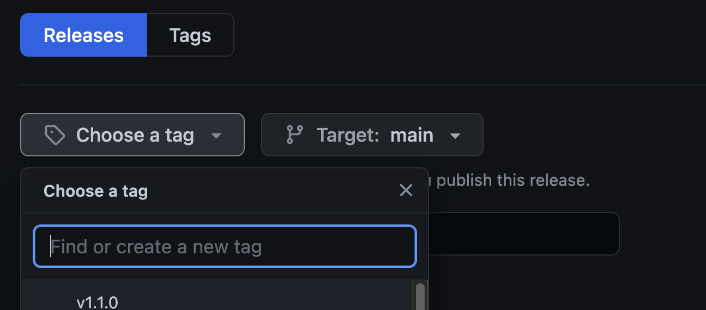

# Release Management for Ruby Core Components

## Semantic Versioning

Samvera Core Components follow the standards established by [the Semantic Versioning guidelines](https://semver.org/). As such, there are three possible types of releases supported:

- Patch (For example, 1.0.1 following 1.0.0)
  - These releases do not introduce any changes which require an upgrade of any kind. These releases also do not include improvements or new features, but instead include security updates or software bug repairs.
- Minor (Example: 1.1.0 following 1.0.0)
  - These releases do not introduce any changes which require an upgrade of any kind, and should never introduce any errors for applications or Gems which depend upon previous minor releases in latest major series (e. g. upgrading to 1.0.2 should never break Ruby applications and Gems which depend upon 1.0.1 or 1.0.0, however compatibility for releases prior to 1.0.0 is not guaranteed).
- Major (Example: 2.0.0 following 1.0.0)
  - These releases introduce changes which require an upgrade for Ruby applications and Gems which depend upon this Gem. As such, no support is strictly guaranteed for previous releases within the last major series of releases (e. g. 2.0.0 may not be compatible with releases 1.9.0 or 1.0.0).

## Releasing a New Version (Patch, Minor, or Major)

### Updating the `changelog`

It is strongly recommended that maintainers for a given component manage [a `changelog`](https://keepachangelog.com/) in order to track the changes which have been introduced within any given release.

As described in the aforementioned website, a `changelog` consists of the following:

> A changelog is a file which contains a curated, chronologically ordered list of notable changes for each version of a project.

Further, ensuring that this log is human-readable is recommended, as simply copying the `git commit` messages can render the log of changes unintelligible.

A recommended tool for generating `changelogs` within a given Ruby component is [chlog](https://github.com/ccmywish/chlog).

### Updating the Version in the Source Code Files

For Ruby Gems, the version must be specified within the [gemspec file](https://guides.rubygems.org/specification-reference/#version). Within many Samvera Gem components, these are managed within separate files (for an example, please see https://github.com/samvera/ldp/blob/main/ldp.gemspec#L8 and https://github.com/samvera/ldp/blob/main/lib/ldp/version.rb).

### Creating the Pull Request

Following these steps, one should be in the position to then [create a pull request using GitHub](https://docs.github.com/en/pull-requests/collaborating-with-pull-requests/proposing-changes-to-your-work-with-pull-requests/creating-a-pull-request).

**An important note: please do not name the branch following the pattern `v$RELEASE` (for example `v1.0.0`). There is an automated process for publishing the release to RubyGems with which this pattern of branch-naming will introduce conflicts.**

As is the standard practice for Samvera contributions, the pull request must first be reviewed by a fellow member of Samvera. Once this pull request has been approved of, and the continuous integration test suites have passed, the pull request may be merged. Should one require member of Samvera to review the pull request, please freely message the [#component-maintenance Channel on the Samvera Slack](https://samvera.slack.com/app_redirect?channel=component-maintenance) with the URL to the pull request in need of review.

### Tagging and Publishing the Release to RubyGems

Once the previously described pull request has been approved of and merged, one may `git tag` and publish the release to the [RubyGems Gem registry](https://rubygems.org/) with the following invocation:

```bash
# This ensures that one is using the newest commits for the `main` branch
$ git checkout main
$ git fetch origin
$ git pull --rebase origin main
# This ensures that all Gem dependencies are installed
$ bundle install
$ bundle exec rake release
```

One should then be able to view the new release listed on RubyGems. For example, for release `1.1.0` for `samvera/ldp`, one will find this published on <https://rubygems.org/gems/ldp/versions/1.1.0>.

### Publishing the GitHub Release

One may then be able to publish the accompanying [GitHub Release]() for the GitHub project. As the previous step for publishing the RubyGems release creates a new `git tag`, one can simply reference this on the GitHub release form:



The description of the release conventionally follows this format:

```bash

## What's Changed
### New Features
* Some new feature in https://github.com/samvera/project/pull/5478
* Backport #5761 to 3.x in https://github.com/samvera/project/pull/5763
### Deprecations
* deprecate MultipleMembershipChecker#validate in favor of #check. in https://github.com/samvera/project/pull/5621
### Bug Fixes
* Fix translations in german locale file in https://github.com/samvera/project/pull/5601
### Documentation
* README.md: fix a typographical error in https://github.com/samvera/project/pull/5602

**Full Changelog**: https://github.com/samvera/project/compare/v3.4.1...v3.4.2
```

Once this release is published, please ensure that this is **not** marked as a `pre-release`.

### Notifying the Samvera Community

Once the previously mentioned tasks have been successfully completed, the final task is to inform the Samvera Community of the new Gem version release. This is achieved by submitting an e-mail message to the [samvera-tech Google Group](https://groups.google.com/g/samvera-tech). These is currenty no standardized format for these messages, however, one proposed format is the following:

_For the message subject:_

> Announcing the Release of `$COMPONENT` 3.4.1

_For the message body:_

> Greetings Members of Samvera,
>
> The 3.4.1 release for `$COMPONENT` is now published and available for community adoption:
>
> https://github.com/samvera/project/releases/tag/v3.4.1
>
> Thank you very much to everyone who has contributed to this latest release (`$USER_0`, `$USER_1`, `...`). Should one encounter any difficulties or have any questions regarding the process of updating to the latest release, please do not hesitate to message component maintainers within the #component-maintenance Slack Channel, or to message the samvera-tech [at] googlegroups [dot] com.
>
> On behalf of the Component Maintenance Interest Group,
> $USER

One may provide any new features or updates within the message body which have substantial impact on the Gem, as well as any significant repairs for software bugs.

Following the submission of this message, the release process has been completed. Should there be any questions or requests for improvements to this document, please do not hesitate to [create an issue for this repository](https://github.com/samvera/maintenance/issues).
